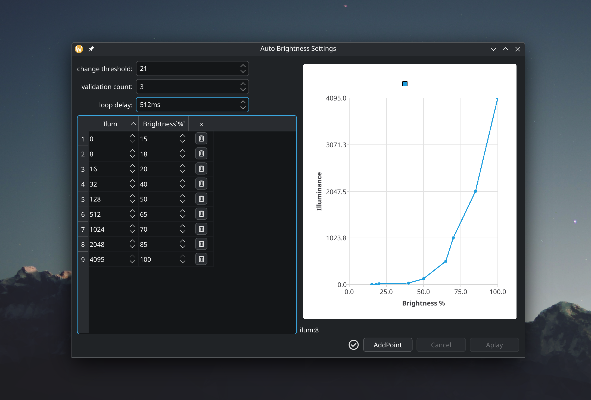

# fw13-auto-brightness

**fw13-auto-brightness** — это система для автоматического управления яркостью экрана ноутбука на основе данных с датчика освещённости.  
Проект состоит из двух частей:  
- **AutoBrightnessIluminance** — демон на C++/DBus, работающий в фоне и управляющий яркостью.  
- **AutoBrightnessUI** — Qt-приложение для настройки параметров демона через графический интерфейс.  


## Скриншоты



## Структура проекта
```bash
fw13-auto-brightness
├── demon/        # исходники AutoBrightnessIluminance
├── ui/           # исходники Qt UI (AutoBrightnessUI)
├── installer/    # установщик, конфиги, иконки, .desktop/.service файлы
└── README.md
```

## Среда разработки

Проект изначально разрабатывался под Arch Linux (KDE Plasma).

Демон использует systemd/*.h для интеграции с DBus/systemd.

UI построен на базе QT6

Для получения полной инфорамции о нужных библиотеках смотреть в 
[demon/CMakeLists.txt](/demon/CMakeLists.txt) и [ui/CMakeLists.txt](/ui/CMakeLists.txt)

## Сборка

Требуется:
- CMake ≥ 3.10
- Qt6 (Core, Widgets, DBus, Charts, Svg, Concurrent)
- systemd headers/INIReader

```bash
#UI
cd ui
mkdir build && cd build
cmake ..
make
./AutoBrightnessUI

#SERVICE
cd demon
mkdir build && cd build
cmake ..
make
./AutoBrightnessIluminance

```

## Установка
Требуются права администратора!

    cd installer
    sudo ./i.sh /opt

Скрипт:
1) скопирует файлы в /opt/autobrightnessiluminance

2) установит autobrightness.desktop и autobrightness.service

3) автоматически запустит демон через systemd

**Внимание**: _демон запускается сразу после установки autobrightness.service!_

# Участие

PR и баг-репорты приветствуются ;)

Планируется:
 - Добавить больше настроек в UI
 - Расширить поддержку других DE (Gnome, XFCE)
 - Тестирование на разных ноутбуках

## Developer

- **Name**: Tymofii
- **GitHub**: [Ch-Tima](https://github.com/Ch-Tima)

## License
This project is licensed under the GNU Affero General Public License v3.0 (AGPL-3.0)  
See the [LICENSE](LICENSE) file for details.